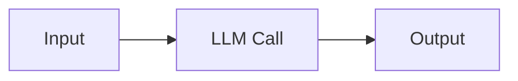

# liuzhne.github.io

一个基于 Astro 的中文个人技术博客，部署在 GitHub Pages：

<https://liuzhne.github.io>

站点内容聚焦 AI 工程、Java、云原生、LLM Workflow 与研究工程实践。项目采用静态构建，文章通过 Astro Content Collections 管理，适合低维护成本地发布长期技术笔记。

## 技术栈

- [Astro](https://astro.build/) 6：静态站点生成与内容集合
- Tailwind CSS 4：通过 `@tailwindcss/vite` 接入
- Markdown：博客文章内容源
- Mermaid：文章中的流程图与架构图渲染
- GitHub Pages：生产部署目标

运行环境要求：

```bash
node >= 22.12.0
```

## 功能概览

- 首页展示个人简介、技术标签和最新文章
- 博客列表按发布时间倒序展示，并过滤 `draft: true`
- 文章详情页支持标题、描述、标签、作者、发布时间和更新时间
- 顶部搜索支持博客列表搜索；文章页支持正文内容搜索与高亮
- 暗色模式基于 `<html class="dark">`，首屏前读取 `localStorage.theme` 避免闪烁
- Mermaid 代码块会在文章页自动渲染为流程图，并针对节点数量、分支复杂度自动调整尺寸
- GitHub Actions 在 `main` 分支推送后自动构建并部署到 GitHub Pages

## 目录结构

```text
.
├── .github/workflows/deploy.yml       # GitHub Pages 部署流水线
├── astro.config.mjs                   # Astro 与 Vite/Tailwind 配置
├── package.json                       # npm 脚本与依赖
├── src
│   ├── assets                         # 图片与静态资源
│   ├── components                     # 导航、首页 Hero、最新文章、页脚等组件
│   ├── content.config.ts              # posts 内容集合定义
│   ├── content/posts                  # 博客 Markdown 文章
│   ├── layouts                        # 全站布局与文章布局
│   ├── pages                          # Astro 路由页面
│   └── styles/global.css              # 全局样式、排版、Mermaid 样式
└── tsconfig.json
```

## 本地开发

安装依赖：

```bash
npm install
```

启动开发服务器：

```bash
npm run dev
```

默认访问：

```text
http://localhost:4321/
```

生产构建：

```bash
npm run build
```

预览构建结果：

```bash
npm run preview
```

说明：项目当前没有配置独立测试 runner 或 lint 脚本。`npm run astro check` 会调用 Astro CLI 的检查能力；如果本地尚未安装 `@astrojs/check` 和 `typescript`，Astro 会提示补装依赖。

## 写作与发布

新文章放在：

```text
src/content/posts/
```

文件名会成为文章路由的一部分。例如：

```text
src/content/posts/building-effective-agents.md
```

对应页面：

```text
/blog/posts/building-effective-agents/
```

注意：项目在 `astro.config.mjs` 中启用了：

```js
trailingSlash: 'always'
```

因此内部链接需要保留结尾 `/`，例如 `/blog/posts/foo/`。

文章 frontmatter 示例：

```md
---
title: '文章标题'
description: '用于列表、SEO 与文章页导语的简短描述。'
pubDate: 2026-05-23
updatedDate: 2026-05-23
tags: ['AI Agent', 'Workflow']
author: 'liuzhne'
draft: false
---
```

字段说明：

| 字段 | 是否必填 | 说明 |
| --- | --- | --- |
| `title` | 是 | 文章标题 |
| `description` | 是 | 文章描述 |
| `pubDate` | 是 | 发布时间 |
| `updatedDate` | 否 | 更新时间 |
| `tags` | 否 | 标签数组，默认 `[]` |
| `author` | 否 | 作者，默认 `Anonymous` |
| `draft` | 否 | 是否草稿，`true` 时不会出现在博客列表 |

## Mermaid 图表

文章中可以直接使用 Mermaid 代码块：

````md

````

文章布局会在浏览器中加载 Mermaid 并自动渲染图表。当前样式做了几类适配：

- 节点按语义区分颜色，例如 LLM、Agent、Gate、Aggregator、Endpoint
- 少节点图限制最大宽度，避免在文章中显得过大
- 分支多或横向较长的图限制宽高并降低字号，保持可读性
- Mermaid 外层容器保留轻量边框，不使用大面积背景色

## 部署

部署配置位于：

```text
.github/workflows/deploy.yml
```

触发方式：

- 推送到 `main`
- 手动触发 `workflow_dispatch`

流水线步骤：

1. 使用 Node.js 22
2. 清理 `.astro` 和 `dist`
3. 执行 `npm ci`
4. 执行 `npm run build`
5. 上传 `dist/`
6. 发布到 GitHub Pages

## 维护注意事项

- 这是静态站点，生产环境没有服务端运行时
- `main` 分支即生产环境，没有单独 preview 环境
- Tailwind v4 配置集中在 `src/styles/global.css` 与 Vite 插件中，没有 `tailwind.config.js`
- 新增内部链接时务必使用带尾斜杠的路径
- 修改文章布局时注意文章页搜索脚本与 Mermaid 渲染脚本都在 `src/layouts/BlogPost.astro`
