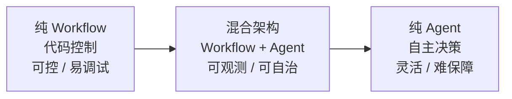
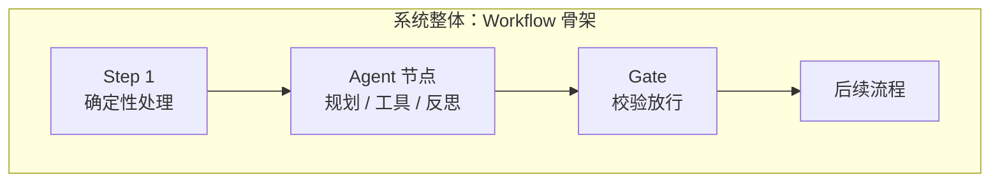
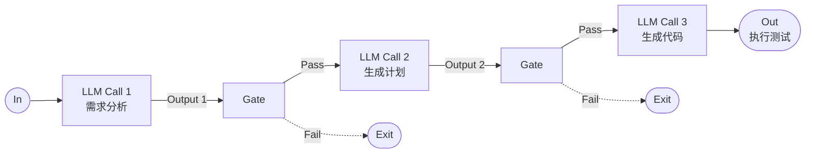
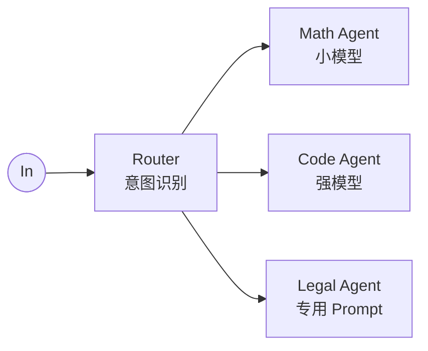
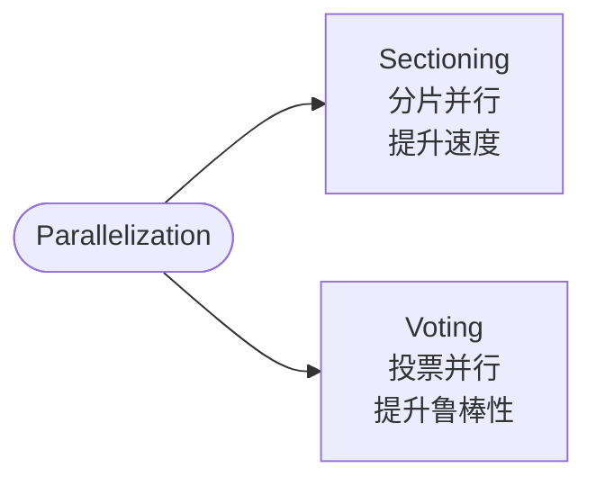
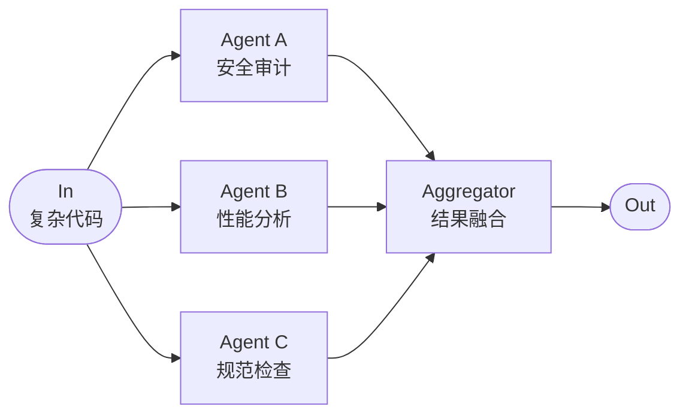
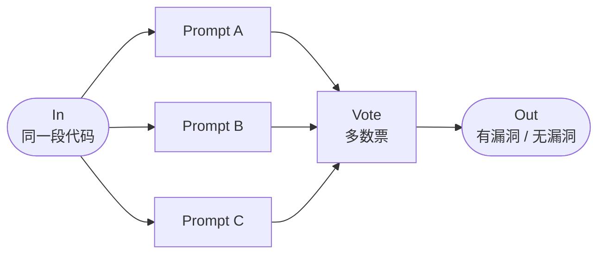
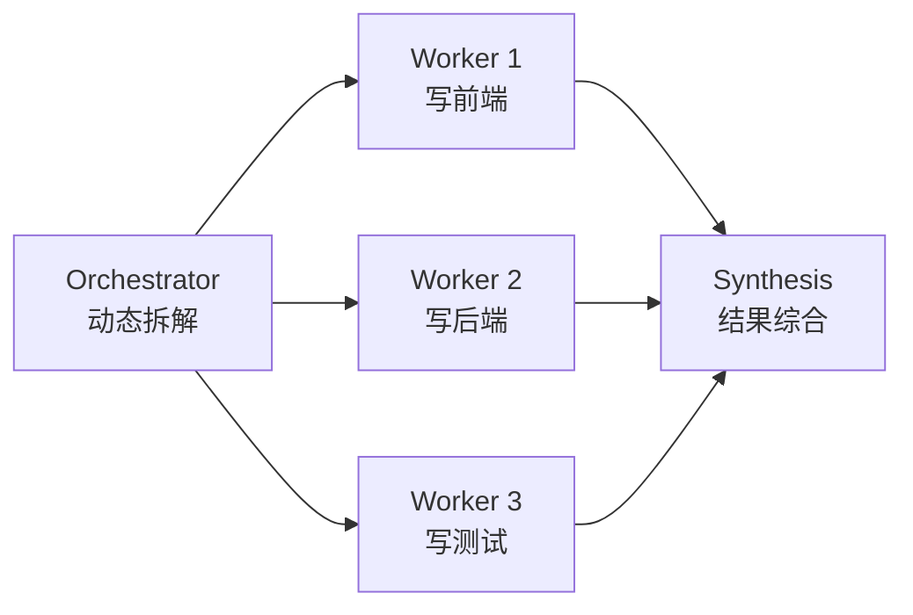
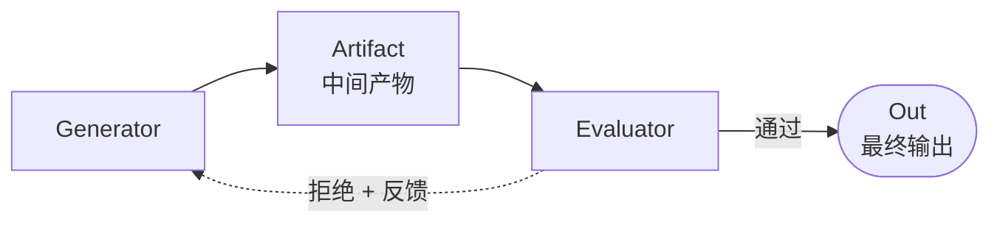
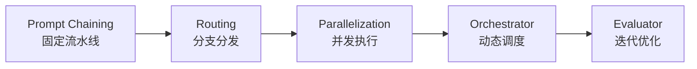

> **导读**：2024 年 12 月 19 日，Anthropic 工程师 Erik Schluntz 与 Barry Zhang 联合发表了《Building effective agents》。这篇文章的价值不在于定义了什么是 Agent，而在于它系统性地回答了一个更难的问题：*"什么时候该用 Agent，什么时候只需要 Workflow？"* 它第一次在工程层面厘清了两者的边界——不是对立，而是互补共生。随着 AI 行业从盲目的"智能体热潮"回归工程理性，文中提炼的五种架构模式在 2026 年已被 LangGraph、CrewAI 等主流框架广泛采纳，成为工业界落地实践的事实标准。

---

## 一、从对立到共生：Workflow 与 Agent 的真实关系

在讨论概念之前，有必要先破除一个行业误区：**Workflow 和 Agent 并非替代关系，而是同一个系统在不同层次上的两种表达。**

### 1.0 概念的起源：Anthropic 原文是怎么说的

"Agentic Systems"这一概念，正式提出于 2024 年 12 月 19 日 Anthropic 的这篇文章。原文开篇即点明了写作背景：

> *"Over the past year, we've worked with dozens of teams building large language model (LLM) agents across industries. Consistently, the most successful implementations weren't using complex frameworks or specialized libraries. Instead, they were building with simple, composable patterns."*
>
> ——《Building effective agents》，Erik Schluntz & Barry Zhang，2024.12.19

这句话揭示了"Agentic Systems"概念的工程来源：它不是理论推演，而是从**数十个真实生产案例**中归纳出来的。

紧接着，原文对"Agent"这个被滥用的词做了一次正本清源：

> *"'Agent' can be defined in several ways. Some customers define agents as fully autonomous systems that operate independently over extended periods, using various tools to accomplish complex tasks. Others use the term to describe more prescriptive implementations that follow predefined workflows.*
>
> *At Anthropic, we categorize all these variations as **agentic systems**, but draw an important architectural distinction between workflows and agents:*
> - *Workflows are systems where LLMs and tools are orchestrated through predefined code paths.*
> - *Agents, on the other hand, are systems where LLMs dynamically direct their own processes and tool usage, maintaining control over how they accomplish tasks."*

这段原文的工程意义深刻：Anthropic 没有在"Workflow"和"Agent"之间站队，而是用 **"Agentic Systems"** 作为统一的总括性概念将两者都纳入其中。真正的分野不在于"用哪个"，而在于"在系统的哪个位置、用哪个"。

### 1.1 工程化演进的三个阶段

实际工程中，AI 系统的演进并非一次性的技术选型，而是沿着一条可预测的路径逐步深入：

绝大多数团队的真实路径是这样的：

- **起点**：用 Prompt Chaining 把复杂任务拆开，验证 LLM 能否完成每个子步骤；
- **中期**：在稳定的 Workflow 骨架中，逐步将"规则难以覆盖"的节点替换为 Agent；
- **成熟期**：形成"Workflow 定边界、Agent 做推理"的混合架构，而非全面转向纯 Agent。

### 1.2 两者不是对立的，而是按需组合、互为补充

理解这一点的关键，是把 Workflow 和 Agent 的分工想清楚：

| | Workflow | Agent |
|---|---|---|
| **核心职责** | 定义执行骨架，保障业务下限 | 在节点内动态推理，拔高智能上限 |
| **控制权归属** | 工程代码 | LLM 自身 |
| **执行路径** | 预定义、固定 | 动态决定、不可预测 |
| **最适合的场景** | 步骤明确、路径可预测的任务 | 开放任务、需要泛化推理的节点 |
| **生产环境优势** | 可观测、可调试、成本可控 | 能处理规则无法覆盖的边缘情况 |

在一个成熟的生产系统中，两者往往同时存在于不同层次：

外层 Workflow 保障整体流程的可控性与 SLA；内层 Agent 节点负责处理规则无法穷举的推理任务。两者的边界不是竞争，而是职责分工。

### 1.3 Anthropic 的底层立场：从简单开始，按需引入复杂度

原文对工程师的核心建议，在开篇即已给出：

> *"When building applications with LLMs, we recommend finding the simplest solution possible, and only increasing complexity when needed. This might mean not building agentic systems at all. Agentic systems often trade latency and cost for better task performance, and you should consider when this tradeoff makes sense.*
>
> *When more complexity is warranted, workflows offer predictability and consistency for well-defined tasks, whereas agents are the better option when flexibility and model-driven decision-making are needed at scale."*

这段话的工程含义极为明确：**从 Prompt Chaining 开始，只在更简单的方案真正不够用时，才引入 Agent 的动态决策能力。** 盲目追求"全 Agent"架构，本质上是用复杂度换来了不确定性，而不是换来了更好的结果。原文甚至直接说：有时候"不构建任何 Agentic System"才是正确的工程决策。

---

## 二、前置基础：增强型 LLM（Augmented LLM）

原文强调，所有 Agent 系统的**基础构建块**不是裸模型，而是经过三项能力增强的 LLM：

| 增强能力 | 作用 |
|---|---|
| **Retrieval（检索）** | 主动生成搜索查询，从外部数据库、文档、互联网中获取信息 |
| **Tools（工具）** | 调用外部 API、执行代码、操作文件系统等 |
| **Memory（记忆）** | 决定哪些信息应当保留并在后续步骤中复用 |

> Anthropic 将此概念称为 **Augmented LLM**，它是区分"普通对话模型"与"智能体基础设施"的第一道门槛。MCP（Model Context Protocol）正是 Anthropic 为标准化工具集成而推出的协议层，目前已由 Linux Foundation 统一管理，成为各主流框架的标配集成协议。

---

## 三、五大核心架构模式深度解析

Anthropic 基于大量生产案例提炼出五种典型架构，构成了 AI 系统设计的基础"乐高积木"。它们既可以单独使用，也可以按需嵌套组合——五种模式本身，就是"Workflow 与 Agent 互补共生"这一理念的具体工程实现。

---

### 1. Prompt Chaining（提示链）

将复杂任务拆分为多个顺序步骤，上一步的输出作为下一步的输入。原文还引入了 **Gate（检查门）** 机制——在任意中间步骤插入程序化校验，确保流程没有偏离轨道后再继续。

**在 Workflow/Agent 光谱中的位置**：最靠近 Workflow 端，控制权完全在代码侧。LLM 只是流水线上的执行单元，Gate 由工程代码决定是否放行。

**核心优势**：

- **高稳定性**：工程落地成本极低；
- **易于调试**：可清晰定位是哪一步发生了偏移；
- **生产友好**：天然支持中间状态的可观测、可缓存（Cache）、可回滚；
- **Gate 机制**：允许在关键节点插入人工审核或自动化校验，防止错误向下游传播。

**局限性**：存在**误差传播**风险（前一步出错，后续全受影响），且无法处理路径不确定的开放任务。

**最佳场景**：标准 RAG 流水线、结构化文档合规分析、多阶段内容生成流程。

---

### 2. Routing（路由）

先通过 Router 分类识别意图，再将请求分发给对应的专用处理路径或下游 Agent。

**在 Workflow/Agent 光谱中的位置**：骨架仍是 Workflow（分支路径预定义），但下游的每个分支可以是纯 Workflow，也可以是 Agent——Routing 本身是 Workflow 与 Agent 协作的典型入口形态。

**核心优势**：

- **专业化**：各路径针对特定领域深度优化，避免"一个 Prompt 走天下"的性能损耗；
- **成本优化**：简单任务路由至低成本小模型，复杂任务调用高成本大模型，显著降低整体推理开销。

**局限性**：Router 是**单点故障源（Single Point of Failure）**，路由判断一旦错误，下游全盘承压。

**工程建议**：Router 节点必须使用推理能力最强的模型，并配合严格的 Few-Shot 示例或结构化 Schema 约束分类边界。

---

### 3. Parallelization（并行化）

多个 LLM 实例同时处理任务，最后由聚合器（Aggregator）汇聚结果。原文明确区分了两种核心变体：

**Sectioning 示例**：

**Voting 示例**：

**原文给出的典型用例**：

- **Sectioning**：用一个模型实例处理用户请求，同时用另一个实例做内容安全审查（Guardrail），两者互不干扰；
- **Voting**：代码漏洞审查中，多个 Prompt 变体并发评估同一段代码，有任意一个标记问题则触发告警。

**在 Workflow/Agent 光谱中的位置**：并发结构由 Workflow 定义（哪些子任务并行是预定义的），但每个并发节点内部可以独立运行 Agent 逻辑——并行化是 Workflow 调度能力与 Agent 执行能力的直接叠加。

**局限性**：Token 消耗呈倍数上升；Aggregation 阶段的去重、冲突消解和结果排序算法设计难度不容低估。

---

### 4. Orchestrator-Workers（协调器-工作器）

Orchestrator（中央 LLM）负责动态拆解任务与调度，Workers 负责专注执行子任务。与并行化的关键区别在于：**子任务不是预定义的，而是由 Orchestrator 根据具体输入动态决定的**。

**在 Workflow/Agent 光谱中的位置**：这是五种模式中 Workflow 与 Agent 融合最深的一种——**Orchestrator 本身就是一个 Agent**（动态规划、自主决策），而 Workers 则相对更接近 Workflow（各自执行单一、明确的子任务）。整体系统是"Agent 驱动的 Workflow 执行"。

**核心价值**：在执行层保持相对确定性的同时，在调度层引入**动态规划**能力，是混合架构中最成熟的落地形态。

**原文给出的典型用例**：

- 需要同时修改多个文件的代码生成系统（Anthropic 自己的 Coding Agent 即采用此模式）；
- 需要从多个来源搜集、分析并综合信息的研究类任务。

---

### 5. Evaluator-Optimizer（评估器-优化器）

通过"生成 → 评估 → 反馈 → 重生成"的闭环，让 LLM 系统具备**自我反思（Reflection）**能力。

**原文给出的适用条件**：

1. LLM 的响应能够通过反馈得到明显改善；
2. LLM 自身能够提供有效的评估反馈（即 Evaluator 角色可以由 LLM 胜任）。

**在 Workflow/Agent 光谱中的位置**：闭环结构本身是 Workflow（迭代路径固定），但每次迭代中 Generator 和 Evaluator 都在运行 Agent 级别的推理——这是用 Workflow 的确定性结构，驯化 Agent 的不确定性输出的典型范例。

**核心价值**：将"调用一次模型"升级为"构建会迭代的智能系统"。Evaluator 捕获具体的失败信息（如编译报错、测试失败日志）并反馈给 Generator，形成闭环修复。

**典型应用**：Code Agent 的编译-测试-修复循环、高精度文档翻译（迭代改进细微语义偏差）、自我纠错型 RAG。

**注意**：必须设置**终止条件**（如最大迭代次数），防止无限循环——这是生产部署中最常被忽视的风险点。

---

## 四、五种模式的定位总览

从 Workflow/Agent 融合深度来看，五种模式形成了一条连续的光谱：

| 架构模式 | 流程确定性 | Agent 介入程度 | 生产可控性 | Token 成本 | 最佳适用场景 |
|---|---|---|---|---|---|
| **Prompt Chaining** | 极高 | 最低（执行节点） | 极高 | 低 | 步骤清晰、路径可预测的任务 |
| **Routing** | 高 | 低（分支入口） | 高 | 较低 | 多类型请求的统一入口 |
| **Parallelization** | 中 | 中（节点内部） | 中 | 高 | 需要速度或多角度置信度的任务 |
| **Orchestrator-Workers** | 中低 | 高（顶层调度） | 中 | 较高 | 子任务不可预定义的复杂任务 |
| **Evaluator-Optimizer** | 循环确定 | 高（双向推理） | 高（依赖终止条件） | 极高 | 有明确评估标准、需迭代精炼的任务 |

---

## 五、行业现状：2026 年框架格局的收敛

Anthropic 这篇文章发布后，其五种模式迅速成为主流框架的设计参照。值得注意的是，2026 年框架生态的竞争焦点，已从"谁更像 Agent"转向"谁的混合架构做得更好"：

- **LangGraph** 于 2025 年底发布 v1.0，以图结构状态机为核心，GitHub Star 数于 2026 年初超越 CrewAI，成为企业级生产部署的主流选择——其核心价值正是对 Workflow 边界与 Agent 节点的精细控制，原生支持 Checkpoint、Human-in-the-loop 和 MCP；
- **CrewAI** 以角色化多 Agent 协作为特色（本质是 Orchestrator-Workers 模式的高层抽象），入门门槛最低，是快速原型验证的首选；
- **AutoGen**（微软研究院）于 2026 年 4 月以 v1.0 GA 形式并入 **Microsoft Agent Framework**（整合了 Semantic Kernel），进入维护模式；
- **MCP（Model Context Protocol）** 于 2025 年移交至 Linux Foundation 管理，现已成为各大框架的标配工具集成协议，大幅降低了跨框架切换工具的成本；
- **Anthropic Claude Agent SDK** 于 2025 年底发布，作为 Claude Code 底层运行时，在 2026 年获得快速增长。

> 所有主流框架的演进方向，都在印证同一个结论：**没有一个成熟的生产框架选择"纯 Agent"路线。** 框架竞争的核心，是谁能让开发者更精细地控制"Workflow 与 Agent 的边界在哪里"。

---

## 六、工程结论：用 Workflow 定边界，用 Agent 做推理

Anthropic 这篇文章给工程界带来的最清醒的认知，可以用一句话概括：

**Workflow 是 Agent 的脚手架，Agent 是 Workflow 的灵魂——两者缺一不可，过度偏向任何一端都会付出代价。**

偏向 Workflow 端：系统僵硬，无法泛化，覆盖不了边缘情况，维护成本随规则膨胀而爆炸。
偏向 Agent 端：系统不可预测，成本失控，无法调试，生产 SLA 无从保障。

> ### 落地工程原则（原文三条核心建议）
>
> 原文的收尾同样是一段值得铭记的工程宣言：
>
> *"Success in the LLM space isn't about building the most sophisticated system. It's about building the right system for your needs. Start with simple prompts, optimize them with comprehensive evaluation, and add multi-step agentic systems only when simpler solutions fall short."*
>
> 具体到实施层面，原文归纳为三条原则：
>
> 1. **保持设计的简洁性（Simplicity）**：从直接调用 LLM API 开始，许多模式只需几行代码即可实现；如使用框架，务必理解其底层实现，黑盒假设是生产事故的常见来源。
> 2. **优先保障透明性（Transparency）**：明确展示 Agent 的规划步骤，让系统行为可观测、可解释。
> 3. **精心设计工具接口（ACI）**：Agent-Computer Interface 的质量直接决定 Agent 的可靠性，工具文档必须清晰且经过充分测试。

实际工程中的最优解永远是：**在 Workflow 的确定性骨架内，精准地在需要泛化推理的节点上释放 Agent 的能力。** 知道在哪里放开控制权，和知道在哪里收紧控制权，同样重要。

这才是 AI 工程化演进的黄金法则。

---

*原文参考：[Building effective agents — Anthropic](https://www.anthropic.com/news/building-effective-agents)（2024 年 12 月 19 日，Erik Schluntz & Barry Zhang）*
